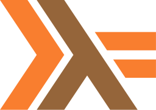

### Hi there 👋

I'm Ignacio Herrera, a 🇦🇷 self-taught software engineer, passionate about cybersecurity and martials arts. I work as a _Solutions Architect_ at [Agile Engine](https://agileengine.com/) and become an indie hacker at night 🦸.

- 🧑‍🚀 Nickname: _Nacho_.
- :shipit: Indie hacker projects: [Fastrack](https://fastrack.ing)
- 🧑‍🎓 Creating educational content: [Architect Handbook](https://github.com/herrera-ignacio/architect-handbook).
- 📖 Currently reading: _Artificial Intelligence: A Guid for thinkikng humans_.
- 📫 How to reach me: [LinkedIn](https://www.linkedin.com/in/ignacioromanherrera/), [X](https://x.com/bitsofnacho), [Instagram](https://www.instagram.com/bitsofnacho), or <a href="mailto:ignacioromanherrera@gmail.com">a good-old email</a>.
- 😛 Fun fact: _I'm a father of 3 beloved dogs, Pipo, Nina and Shaki_.

#### Favorite Tech

> The following are technologies I like to work with, in no particular order. This doesn't mean I'm an expert at any of them neither that I don't work with other tecnologies.

<table>
  <tr>
    <td align="center" width="96">
      
       Javascript
    </td>
    <td align="center" width="96">
      
       TypeScript
    </td>
    <td align="center" width="96">
      
       Node
    </td>
    <td align="center" width="96">
      
       React
    </td>
    <td align="center" width="96">
      
       Redux
    </td>
    <td align="center" width="96">
        
       C++
    </td>
    <td align="center" width="96">
      
       Python
    </td>
    <td align="center" width="96">
      
       Golang
    </td>
    <td align="center" width="96">
      
       Haskell
    </td>
  </tr>
  <tr>
    <td align="center" width="96">
      
       Graphql
    </td>
    <td align="center" width="96">
      
       Sequelize
    </td>
    <td align="center" width="96">
      
       Postgres
    </td>
    <td align="center"  width="96">
      
       MySQL
    </td>
    <td align="center" width="96"> 
      
       Docker
    </td>
    <td align="center"  width="96">
        
       Arch Linux
    </td>
    <td align="center"  width="96">
      
       Ubuntu
    </td>
    <td align="center" width="96">
      
       Kali
    </td>
    <td align="center" width="96"> 
      
       AWS
    </td>
  </tr>
</table>

#### Github Activity

